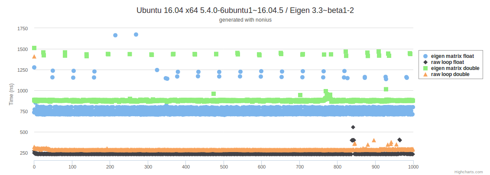

# Benchmark of Colwise Eigen Matrix Multiplication vs. Raw Loop

In the spirit of Sean Parent's [GNRL (Goal No Raw Loops)](https://twitter.com/SeanParent/status/929292062087884800) for writing gnarly code I try to avoid explicit loops when a library offers the same functionality in a dedicated function. This should give as much information as possible to the library which can be leveraged for optimizations inside the library.

For the seemingly simple case of transforming a list (stored as `Eigen::Matrix`) of 3d points the raw loop is approximately 2-3x faster than the equivalent Eigen function. Comparing the assembly (for Eigen 3.4.4) in [Compiler Explorer](https://godbolt.org/g/atG6uA) indicates there might be some allocation involved inside Eigen, which is not done for the raw loop.

This benchmark has been created to illustrate the difference after the code has been changed in a more convoluted real program, that reads millions of 3d points, transforms them as done in this benchmark and then works with these transformed points. The effects of changing the implementation were consistently measurable and led to this minimal benchmark.

This repository contains the code for a [corresponding mailinglist thread](https://listengine.tuxfamily.org/lists.tuxfamily.org/eigen/2018/01/msg00013.html).

## Code

Essentially the following code is tested and compared:
```cpp
using pointlist = Eigen::Matrix<double, 3, Eigen::Dynamic, Eigen::RowMajor>;
using transform = Eigen::Transform<double, 3, Eigen::Isometry>;

extern pointlist points;
extern const transform trans;

void eigen_matrix_transformation()
{
    points = (trans * points.colwise().homogeneous());
}

void raw_loop_transformation()
{
    for(auto c = points.cols(); c > 0; --c)
    {
        points.col(c-1) = trans * points.col(c-1).homogeneous();
    }
}
```

## Results

I ran the benchmark on multiple platforms with different Eigen versions. The results were comparable across these platforms and versions, with the raw loop tests being consistently 2-3x faster. The following platforms have been tested (with their respective system default version of Eigen3):

- Ubuntu Trusty 14.04 x86_64 / Eigen 3.2.0
- Ubuntu Trusty 14.04 armv7 / Eigen 3.2.0
- Ubuntu Trusty 14.04 x86 / Eigen 3.2.0
- Ubuntu Xenial 16.04 x86_64 / Eigen 3.2.92
- Ubuntu Xenial 16.04 armv7 / Eigen 3.2.92
- Ubuntu Xenial 16.04 x86 / Eigen 3.2.92

For illustration these are the [results](results_u16_amd64_native.html) on an Ubuntu Xenial 16.04 host with an Intel Core i7-4790 CPU and Eigen 3.3.3 as in Ubuntu's package manager:


I could not reproduce these results on Windows, but in my tests the benchmark takes longer on the Windows host than in a virtual Linux machine hosted there.

## Build

To run the benchmark on your own simply run `make bench`. The benchmark runs only for a few seconds so no worries about blocking your computer.

### Dependencies

- [Eigen3](http://eigen.tuxfamily.org)
- [Nonius](https://nonius.io/) (v1.1.2 single header already provided in project inside `./external/`)
- [Boost.Math](http://www.boost.org/doc/libs/1_66_0/libs/math/) headers (required by Nonius)
- [Boost.Chrono](http://www.boost.org/doc/libs/1_66_0/libs/chrono/) (required for MSVC before Visual Studio 2015 by Nonius)
